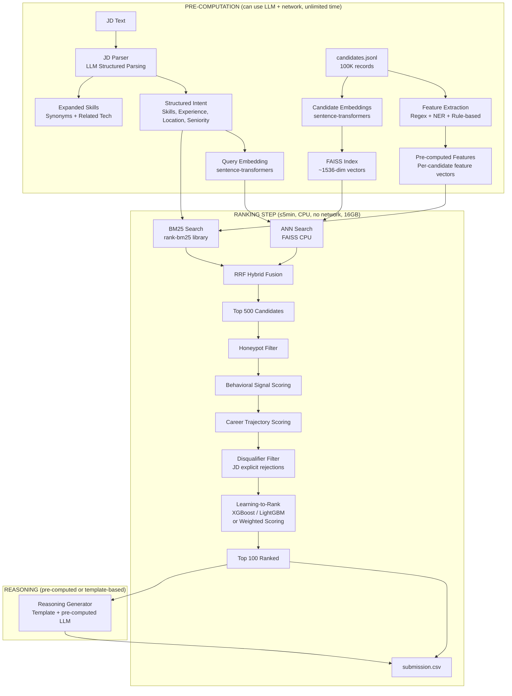

# Intelligent Candidate Discovery — Revised Implementation Plan

> [!CAUTION]
> ## 🚨 CRITICAL DISCOVERY: Hackathon Constraints Change Everything
> After reading the full hackathon bundle (README, JD, submission spec, signals doc), I found **hard constraints** that fundamentally change our architecture:
>
> | Constraint | Limit | Impact |
> |---|---|---|
> | **No Network** | During ranking, zero API calls | ❌ **No OpenAI GPT-5, No Cohere Rerank during ranking** |
> | **CPU Only** | No GPU during ranking | ❌ **No large local LLMs, no heavy embedding models** |
> | **≤ 5 Minutes** | Wall-clock time | ❌ **Can't run LLM per candidate (100K candidates)** |
> | **≤ 16 GB RAM** | Memory limit | ❌ **Can't load everything in memory** |
> | **≤ 5 GB Disk** | Intermediate state | ⚠️ Pre-computed artifacts must be compact |
>
> **What this means**: The live-service architecture (Qdrant + ES + Redis + OpenAI API) is for the **web app demo only**. The actual submission must be a **self-contained, offline ranking script** that runs on CPU in 5 minutes.

---

## The Hackathon Has TWO Deliverables

| Deliverable | Purpose | Technology |
|---|---|---|
| **1. Ranking Engine** | Produces `submission.csv` (top 100 candidates) | Python (required by constraints — must run in sandboxed Docker) |
| **2. Web App (Sandbox/Demo)** | Interactive demo for judges + sandbox requirement | Java/Spring Boot + Kotlin/JS (your preference) |

The ranking engine is what gets **scored** (NDCG@10, NDCG@50, MAP, P@10). The web app is for the **sandbox requirement** and **Stage 5 interview**.

---

## Deep JD Analysis

The JD is for a **Senior AI/ML Engineer at Redrob** (the company running the hackathon). Here's what the JD **actually** requires vs what it **appears** to require:

### What the JD Says vs What It Means

| JD Surface Text | Actual Requirement | Ranking Signal |
|---|---|---|
| "5-9 years experience" | 4-5+ years in applied ML/AI at **product companies** | `years_of_experience` ≥ 5, career_history at product cos |
| "Production embeddings experience" | Actually shipped vector search to users | career_history descriptions mentioning embeddings/search |
| "Vector DB or hybrid search" | Operational experience, not just tutorials | career_history with Qdrant/Milvus/ES/FAISS work |
| "Strong Python" | Code quality matters | Primary language signal (not explicit in data) |
| "Evaluation frameworks" | NDCG/MRR/MAP knowledge | career_history descriptions |
| "Pune/Noida preferred" | India-based, flexible | `location`, `country`, `willing_to_relocate` |
| "Notice period sub-30 days" | Availability signal | `notice_period_days` |

### Explicit Disqualifiers in the JD (MUST FILTER OUT)

| Disqualifier | How to Detect | Why |
|---|---|---|
| **Pure research, no production** | career_history all academic/research roles | "We've tried it twice and it didn't work" |
| **Only LangChain-era AI experience (<12 months)** | Recent AI skills, no pre-2023 ML career | "Understood retrieval before it became fashionable" |
| **Title-chasers** | Company switches every ≤1.5 years, title inflation | "Not a fit, need 3+ year commitment" |
| **Only consulting firms entire career** | All career_history = TCS/Infosys/Wipro/Accenture/Cognizant/Capgemini | "Bad fit experiences in both directions" |
| **Pure CV/Speech/Robotics without NLP/IR** | Skills only in vision/speech/robotics domains | "Re-learning fundamentals" |
| **Hasn't written code in 18 months** | Recent titles = "Architect"/"Tech Lead" with no coding descriptions | "This role writes code" |

### The Trap Warning (from JD)

> *"The right answer is not 'find candidates whose skills section contains the most AI keywords.' That's a trap we've explicitly built into the dataset."*

This means:
- ❌ Don't rank by keyword count
- ❌ A "Marketing Manager" with all AI keywords is NOT a fit
- ✅ A candidate who **built a recommendation system** at a product company IS a fit, even without "RAG" in skills
- ✅ Behavioral signals matter — inactive candidates should be down-weighted

---

## Honeypot Detection (~80 candidates)

> [!WARNING]
> **Submissions with honeypot rate > 10% in top 100 are DISQUALIFIED.** That means max 10 honeypots allowed in your top 100.

### Honeypot Characteristics (from redrob_signals_doc)
- "8 years of experience at a company founded 3 years ago"
- "Expert proficiency in 10 skills with 0 years used"
- Subtly impossible profiles

### Detection Strategy
1. **Duration vs Experience Check**: If `career_history[i].duration_months` > feasible for company founding date
2. **Skill Proficiency vs Duration**: `proficiency = "expert"` but `duration_months = 0` or very low
3. **Skill Count Anomaly**: Unreasonably many "expert" skills (keyword stuffing)
4. **Profile Consistency**: Title doesn't match skills domain (Marketing Manager with 15 AI skills)
5. **Cross-validation**: Total `duration_months` across career doesn't match `years_of_experience`

---

## Scoring Rubric (How We'll Be Judged)

```
Final Score = 0.50 × NDCG@10 + 0.30 × NDCG@50 + 0.15 × MAP + 0.05 × P@10
```

| Metric | Weight | Implication |
|---|---|---|
| **NDCG@10** | **50%** | Top 10 picks are EVERYTHING — get these right |
| **NDCG@50** | 30% | Top 50 matters a lot too |
| **MAP** | 15% | Precision across all 100 |
| **P@10** | 5% | At least get tier 3+ candidates in top 10 |

**Strategy**: Spend most effort on getting the top 10-20 candidates exactly right.

---

## Revised Architecture

### Part 1: Ranking Engine (Python — the scored deliverable)



### Part 2: Web App (Java/Spring Boot + Kotlin/JS — demo + sandbox)

The web app wraps the same ranking logic in an interactive UI. For the sandbox requirement, it needs to:
- Accept ≤100 candidates as input
- Run ranking end-to-end
- Produce ranked CSV
- Complete within 5 min on CPU

---

## Answer to Your Question #1: JD Parsing — Regex/NER vs LLM

Here's the **two-phase approach** that works within constraints:

### Phase A: Pre-Computation (BEFORE ranking — LLM allowed)

| Task | Technique | Why |
|---|---|---|
| **JD → Structured Intent** | **LLM (OpenAI GPT-5)** | Only 1 JD to parse. LLM understands nuance, implicit requirements, "what the JD means vs says" |
| **Skill Expansion** | **LLM (OpenAI GPT-5)** | "embeddings-based retrieval" → expand to "sentence-transformers, FAISS, Qdrant, vector search, ANN, cosine similarity" |
| **Candidate Feature Extraction** | **Regex + NER + Rules** | 100K candidates — LLM per candidate is too slow/expensive. Regex extracts structured fields, rules compute scores |
| **Candidate Embeddings** | **sentence-transformers (local)** | Pre-compute all 100K embeddings, save to disk. One-time cost. |

### Phase B: Ranking (DURING 5-min window — NO LLM, NO network)

| Task | Technique | Why |
|---|---|---|
| **Semantic Search** | **FAISS (CPU)** | Pre-built index, ANN search in milliseconds |
| **Keyword Search** | **rank-bm25 (Python)** | In-memory BM25, no Elasticsearch needed |
| **Scoring** | **XGBoost/LightGBM or weighted formula** | Pre-trained on features, CPU-fast |
| **Reasoning** | **Template-based** | Fill in candidate-specific facts from profile. Can pre-compute with LLM for top candidates. |

---

## Answer to Your Question #2: Kubernetes

For this hackathon, **Kubernetes is not needed** and adds unnecessary complexity:

| Aspect | Assessment |
|---|---|
| **Submission** | Must run in sandboxed Docker (not K8s) |
| **Sandbox** | HuggingFace Spaces / Streamlit Cloud / Docker (not K8s) |
| **Demo** | Docker Compose is sufficient |
| **Scoring** | No points for K8s — judges score NDCG/MAP/P@10 |

**Recommendation**: Use **Docker + Docker Compose** for everything. Mention K8s readiness in presentation if you want, but don't invest time building K8s manifests.

---

## Tech Stack

### Ranking Engine (Python)

| Component | Technology | Rationale |
|---|---|---|
| **Language** | Python 3.11+ | Required for sandbox/Docker reproduction |
| **Embeddings** | `sentence-transformers` (all-MiniLM-L6-v2 or BGE-small) | Local, CPU-fast, no API needed |
| **Vector Index** | FAISS (CPU) | Fast ANN on CPU, fits in 16GB |
| **BM25** | `rank-bm25` Python library | In-memory, no external service |
| **Scoring Model** | XGBoost / LightGBM | Fast CPU inference, feature-based ranking |
| **LLM (pre-computation only)** | OpenAI GPT-5 | JD parsing, skill expansion, reasoning generation |
| **Data Processing** | pandas / polars | Fast JSONL processing |
| **Honeypot Detection** | Custom rules (Python) | Profile consistency checks |

### Web App (Java/Spring Boot + Kotlin/JS)

| Component | Technology | Rationale |
|---|---|---|
| **Backend** | Java 21 + Spring Boot 3.x | Your preference, enterprise-grade |
| **Frontend** | Kotlin/JS + React wrappers | Your preference |
| **Vector DB** | Qdrant (Docker) | For interactive search demo |
| **Search** | Elasticsearch (Docker) | BM25 for demo |
| **Feature Store** | Redis (Docker) | Behavioral signals for demo |
| **Primary DB** | PostgreSQL (Docker) | Candidate/JD storage |
| **LLM** | OpenAI GPT-5 (live API) | Real-time explanations in demo |
| **Reranker** | Cohere Rerank API | Live reranking in demo |
| **Orchestration** | Docker Compose | All services in one file |

---

## Dataset Summary

| Item | Detail |
|---|---|
| **Total Candidates** | 100,000 (in `candidates.jsonl`, 487MB) |
| **Output Required** | Top 100 ranked (CSV: candidate_id, rank, score, reasoning) |
| **Honeypots** | ~80 subtly impossible profiles (>10% in top 100 = DQ) |
| **JD** | Senior AI/ML Engineer at Redrob (ranking/retrieval/matching) |
| **Scoring** | 50% NDCG@10 + 30% NDCG@50 + 15% MAP + 5% P@10 |
| **Max Submissions** | 3 (last valid counts) |
| **No Leaderboard** | Scores revealed only after close |

### Candidate Data Fields Available
- **Profile**: name, headline, summary, location, country, years_exp, current_title, company, company_size, industry
- **Career History** (1-10 entries): company, title, dates, duration, industry, company_size, description
- **Education** (0-5): institution, degree, field, years, grade, **tier (1-4)**
- **Skills** (0+): name, proficiency (beginner→expert), endorsements, duration_months
- **Certifications**: name, issuer, year
- **Languages**: language, proficiency
- **Redrob Signals** (23 fields): completeness, activity, engagement, assessments, salary, work_mode, GitHub, recruiter interactions, verification

---

## Candidate Scoring Feature Design

### Feature Categories (for ranking model)

#### 1. Skill Match Features
| Feature | How to Compute |
|---|---|
| `exact_skill_match_count` | Count of candidate skills that exactly match JD required skills |
| `expanded_skill_match_count` | Count matching expanded skill synonyms |
| `weighted_skill_score` | Sum of (proficiency_weight × endorsements × duration_months) for matching skills |
| `skill_assessment_avg` | Average of `skill_assessment_scores` for relevant skills |
| `has_must_have_skills` | Boolean — has ALL "absolutely need" skills from JD |

#### 2. Experience & Career Features
| Feature | How to Compute |
|---|---|
| `years_of_experience` | Direct from profile |
| `experience_in_range` | 1 if 5-9 years (JD sweet spot), 0.5 if 4-12, 0 otherwise |
| `product_company_years` | Years at non-consulting product companies |
| `consulting_only_flag` | 1 if entire career at TCS/Infosys/Wipro/etc → DISQUALIFY |
| `avg_tenure_months` | Average time at each company (detect title-chasers) |
| `job_hop_flag` | 1 if avg tenure ≤ 18 months → negative signal |
| `career_trajectory_score` | Seniority progression speed |
| `has_production_ml_exp` | NER/regex on career descriptions for "production", "deployed", "shipped" |
| `has_ranking_search_exp` | Descriptions mentioning ranking/search/recommendation/retrieval |

#### 3. Education Features
| Feature | How to Compute |
|---|---|
| `education_tier` | tier_1 (4pts) → tier_4 (1pt) |
| `has_cs_degree` | CS/IT/Math/Stats degree |
| `highest_degree_level` | PhD > Masters > Bachelors |

#### 4. Behavioral Signal Features
| Feature | How to Compute |
|---|---|
| `is_active` | last_active_date within 90 days |
| `is_open_to_work` | open_to_work_flag |
| `recruiter_response_rate` | Direct (higher = better) |
| `response_time_score` | Inverse of avg_response_time_hours |
| `engagement_score` | Composite of profile_views, applications, search_appearances, saved_by_recruiters |
| `github_activity` | github_activity_score (normalize -1 → 0) |
| `interview_reliability` | interview_completion_rate |
| `notice_period_score` | Lower is better (≤30 = best) |
| `salary_fit` | In reasonable range for senior role |
| `verification_score` | verified_email + verified_phone + linkedin_connected |

#### 5. Location & Availability Features
| Feature | How to Compute |
|---|---|
| `location_match` | Pune/Noida = best, other India = good, international = lower |
| `willing_to_relocate` | Direct signal |
| `work_mode_fit` | onsite/hybrid preferred per JD |

#### 6. Honeypot Detection Features
| Feature | How to Compute |
|---|---|
| `experience_consistency` | Sum of career durations ≈ years_of_experience |
| `skill_proficiency_consistency` | Expert skills should have high duration_months |
| `title_skill_mismatch` | Non-tech title + many tech skills = suspicious |
| `is_honeypot` | Composite flag → EXCLUDE from top 100 |

---

## User Review Required

> [!IMPORTANT]
> **Two-System Architecture**: The hackathon now requires TWO systems — a Python ranking engine (for scoring) and a Java/Spring Boot web app (for demo). This doubles the work. Are you OK with this, or should we prioritize the ranking engine and build a simpler web demo (e.g., Streamlit in Python) for the sandbox requirement?

> [!IMPORTANT]
> **Kotlin/JS Risk**: Building the Kotlin/JS frontend adds significant complexity on top of the already-doubled workload. For hackathon time pressure, would you consider React (JavaScript) for the frontend to move faster?

> [!WARNING]
> **Pre-computation with OpenAI**: We need to pre-compute candidate embeddings (100K × sentence-transformers, local) and use GPT-5 for JD parsing + reasoning. Do you have an OpenAI API key ready?

---

## Open Questions

> [!NOTE]
> **Embedding Model Choice**: `all-MiniLM-L6-v2` (384-dim, fast) vs `BGE-small-en-v1.5` (384-dim, better quality) vs `BGE-base-en-v1.5` (768-dim, best quality but more memory). Which balance of speed vs quality do you prefer?

> [!NOTE]
> **Learning-to-Rank vs Weighted Scoring**: Should we train an XGBoost model on synthetic labels (hand-labeled subset) or use a carefully tuned weighted formula? XGBoost is more powerful but needs training data.

---

## Phased Execution Plan

### Phase 1 — Ranking Engine Foundation (HIGHEST PRIORITY)
- [x] Set up Python project structure with dependencies
- [x] Parse JD using GPT-5 → extract structured intent + expanded skills
- [x] Build candidate data loader (stream `candidates.jsonl` efficiently)
- [x] Implement feature extraction pipeline (all 6 feature categories above)
- [x] Implement honeypot detection rules

### Phase 2 — Retrieval & Ranking
- [x] Pre-compute candidate embeddings (sentence-transformers, local)
- [x] Build FAISS index from embeddings
- [x] Implement BM25 search with rank-bm25
- [x] Implement RRF hybrid fusion
- [x] Implement scoring model (XGBoost or weighted formula)
- [x] Generate reasonings for top 100 (LLM pre-computed or template)
- [x] Produce `submission.csv` and validate with `validate_submission.py`

### Phase 3 — Optimize & Validate
- [x] Profile runtime (must be ≤5 min on CPU, ≤16GB RAM)
- [x] Optimize memory usage (streaming, chunked processing)
- [x] Manual review of top 20 candidates — do they make sense?
- [x] Honeypot audit — check if any known traps are in top 100
- [x] Create Dockerfile for sandboxed reproduction

### Phase 4 — Web App (Sandbox + Demo)
- [ ] Initialize Spring Boot + Kotlin/JS multi-module project
- [ ] Set up Docker Compose (Qdrant, ES, Redis, PostgreSQL)
- [ ] Build candidate ingestion pipeline (JSONL → all stores)
- [ ] Build JD input → search → results flow
- [ ] Build interactive UI with premium design
- [ ] Deploy sandbox (HuggingFace Spaces / Streamlit / Docker)

### Phase 5 — Submission Package
- [ ] Prepare GitHub repo with clean README
- [ ] Fill `submission_metadata.yaml`
- [ ] Verify sandbox link works
- [ ] Run `validate_submission.py` final check
- [ ] Submit via portal

---

# Web App (Sandbox + Demo) for Intelligent Candidate Discovery

## Context

Phases 1–3 are complete and frozen:

A Python ranking engine (`ranker/`) that, for a single hardcoded JD (**Senior AI/ML Engineer — Ranking/Retrieval/Matching**), ranks **100K candidates** and emits:

```csv
submission.csv
(candidate_id, rank, score, reasoning)
```

Top 100 candidates are generated in approximately:

- Runtime: ~63 seconds
- Memory: ~2.8 GB RAM

Phase 4 builds an interactive web application so judges can:

- View the contest JD
- Browse ranked candidates
- Open full candidate profiles
- Read AI-generated reasoning
- Trigger a live re-run of the Python ranker
- Watch ranking logs stream in real time

### Hard Constraint

The Python engine is **FINAL** and **must not be modified**.

The web application is strictly:

- A consumer of:
  - `submission.csv`
  - `dataset/candidates.jsonl`
  - `ranker/artifacts/jd_intent.json`
- An orchestrator that shells out to the existing ranking CLI

---

## Locked Decisions

### Data Flow

Use both modes:

1. On startup:
   - Load latest `submission.csv`
   - Show results instantly

2. On demand:
   - "Re-run Ranking" button launches the Python ranker
   - Stream stdout via SSE
   - Reload results when execution completes

### Frontend

- Kotlin/JS
- React wrappers (`kotlin-wrappers`, `kotlin-react`)
- Emotion CSS-in-JS

### Backend

- Java 21
- Spring Boot

### JD Experience

- Fixed contest JD
- Rich visual presentation
- Parsed from `jd_intent.json`
- No free-text JD input

---

# Architecture

```text
Browser (Kotlin/JS + React SPA)
   │
   │ REST + SSE (JSON)
   ▼
Spring Boot (Java 21)
   ├─ ResultsService
   │    Reads submission.csv (Top 100) into memory
   │
   ├─ ProfileService
   │    Streams candidates.jsonl once at startup
   │    Caches only the ~100 profiles present in submission.csv
   │
   ├─ JdService
   │    Reads ranker/artifacts/jd_intent.json
   │
   ├─ MatchService
   │    Java-side display-only match breakdown
   │    (skill coverage, experience fit, location fit, Redrob signals)
   │    NEVER re-ranks candidates
   │
   └─ RunnerService
        ProcessBuilder
        → .venv/bin/python -m ranker.rank ...
        → Streams stdout to SSE
        → Reloads results after completion
```

---

## Engine Invocation

Verified working command:

```bash
.venv/bin/python -m ranker.rank \
  --candidates dataset/candidates.jsonl \
  --artifacts-dir ranker/artifacts \
  --out submission.csv
```

### Runtime Settings

- Working Directory: Repository root
- Environment Variable:

```bash
KMP_DUPLICATE_LIB_OK=TRUE
```

Reference:

```text
redrob-openmp-faiss-fix
```

---

# Repository Layout

```text
webapp/
│
├── settings.gradle.kts
│      Multi-module: :backend, :frontend
│
├── build.gradle.kts
│
├── gradlew
├── gradlew.bat
├── gradle/wrapper/
│      Committed Gradle wrapper
│
├── backend/
│   ├── build.gradle.kts
│   │
│   └── src/main/java/com/redrob/discovery/
│       ├── DiscoveryApplication.java
│       │
│       ├── config/
│       │   └── AppPaths.java
│       │
│       ├── model/
│       │   ├── RankedResult
│       │   ├── CandidateProfile
│       │   ├── JdIntent
│       │   └── MatchBreakdown
│       │
│       ├── service/
│       │   ├── ResultsService
│       │   ├── ProfileService
│       │   ├── JdService
│       │   ├── MatchService
│       │   └── RunnerService
│       │
│       └── web/
│           ├── ApiController
│           └── RankRunController
│
│   └── src/main/resources/
│       └── application.yml
│
├── frontend/
│   ├── build.gradle.kts
│   │
│   └── src/main/kotlin/com/redrob/ui/
│       ├── Main.kt
│       ├── App.kt
│       │
│       ├── api/
│       │   └── Client.kt
│       │
│       ├── model/
│       │   └── Dtos.kt
│       │
│       ├── components/
│       │   ├── JdPanel.kt
│       │   ├── ResultList.kt
│       │   ├── CandidateCard.kt
│       │   ├── ProfileDrawer.kt
│       │   ├── ScoreBar.kt
│       │   └── RunConsole.kt
│       │
│       └── style/
│           └── Theme.kt
│
│   └── src/main/resources/
│       └── index.html
│
├── docker-compose.yml
│
└── README-webapp.md
```

---

## Frontend Packaging

Webpack bundle is copied into:

```text
backend/src/main/resources/static/
```

Spring Boot serves the SPA at:

```text
/
```

Deployment artifact:

```text
Single executable JAR
```

Development mode:

```text
Kotlin Webpack Dev Server
           +
Spring Boot Proxy (:8080)
```

---

# REST / SSE API

## JD

```http
GET /api/jd
```

Returns:

- Title
- Summary
- Must-have skill categories
- Keywords
- Experience band
- Location
- Signals

---

## Results

```http
GET /api/results?limit=100
```

Returns:

```json
{
  "rank": 1,
  "score": 0.98,
  "candidate_id": "...",
  "reasoning": "...",
  "profileSummary": {
    "name": "...",
    "headline": "...",
    "currentTitle": "...",
    "currentCompany": "...",
    "yoe": 7,
    "location": "...",
    "topSkills": [],
    "openToWork": true,
    "noticePeriodDays": 30,
    "responseRate": 0.91
  }
}
```

---

## Candidate Details

```http
GET /api/candidates/{id}
```

Returns:

- Full CandidateProfile
- Reasoning
- Score
- MatchBreakdown

---

## Status

```http
GET /api/status
```

Returns:

```json
{
  "resultsLoadedAt": "...",
  "count": 100,
  "lastRun": {
    "status": "...",
    "startedAt": "...",
    "finishedAt": "...",
    "exitCode": 0
  }
}
```

---

## Start Ranking

```http
POST /api/rank/run
```

Returns:

```json
{
  "runId": "..."
}
```

Returns:

```http
409 Conflict
```

if another run is already active.

---

## Live Logs (SSE)

```http
GET /api/rank/stream
```

Events:

```text
log
done
error
```

Workflow:

1. Stream Python stdout
2. Process exits
3. Backend reloads ResultsService
4. Backend reloads ProfileService
5. Frontend refreshes results

---

# Backend Implementation Notes

## AppPaths

Repository root:

```text
webapp/..
```

Environment overrides:

```text
DISCOVERY_REPO_ROOT
DISCOVERY_PYTHON
```

---

## ProfileService

Startup workflow:

```text
submission.csv
      ↓
Extract candidate IDs
      ↓
Single pass over candidates.jsonl
      ↓
Keep only matching candidates
      ↓
Map<String, CandidateProfile>
```

Implementation:

- Jackson Streaming
- `ObjectMapper.readTree()`
- Stores ~100 candidates
- Uses only a few MB of RAM

Re-runs reload using the same process.

---

## MatchService

Display-only indicators.

Never affects ranking.

### Metrics

#### Skill Coverage

```text
Matched JD categories
---------------------
Total JD categories
```

#### Experience Fit

Compared against:

```text
Ideal range: 6–8 years
```

#### Location Fit

Compared against:

- Preferred locations
- Acceptable locations

#### Signal Chips

- open_to_work
- recruiter_response_rate
- notice_period_days
- recently_active

Produces UI-friendly scores:

```text
0.0 → 1.0
```

---

## RunnerService

Execution:

```java
ProcessBuilder(
    python,
    "-m",
    "ranker.rank",
    ...
)
```

Configuration:

```java
directory(repoRoot)
environment().put(
    "KMP_DUPLICATE_LIB_OK",
    "TRUE"
);
```

Behavior:

- Single-flight execution
- Streams stdout line-by-line
- Sends logs through SSE
- Writes CSV to temporary file
- Atomically swaps file on completion

---

## CSV Parsing

Use either:

- Apache Commons CSV

or

- Minimal quoted-field parser

Reason:

```text
reasoning column contains commas and quotes
```

---

# Frontend Implementation Notes

## Dependencies

- kotlin-react
- kotlin-react-dom
- kotlin-emotion
- kotlinx-coroutines-core-js
- kotlinx-serialization-json

---

## App Layout

On mount:

```text
GET /api/jd
GET /api/results
```

Layout:

```text
┌───────────────┬────────────────────┐
│   JD Panel    │   Result List      │
└───────────────┴────────────────────┘
```

---

## CandidateCard

Displays:

- Rank badge
- Name
- Headline
- Composite score bar
- Matched skill chips

Click action:

```text
Open ProfileDrawer
```

---

## ProfileDrawer

Displays:

- Full profile
- Career history
- Education
- Skills + proficiency
- Redrob signals
- AI reasoning
- Match breakdown

---

## RunConsole

Workflow:

```text
Re-run Ranking
      ↓
POST /api/rank/run
      ↓
Open EventSource
      ↓
Stream logs
      ↓
Show terminal UI
      ↓
Auto-refresh results
```

Features:

- Spinner
- Toast notifications
- Live terminal output

---

## Branding

- Modern UI
- Dark theme
- Accent highlights
- Responsive cards
- Redrob branding

---

# Docker / Sandbox

## docker-compose.yml

Single service:

```text
Frontend Build
      ↓
Backend Build
      ↓
Spring Boot JAR
```

Runtime:

- JRE 21
- Python 3
- Venv dependencies

Mounts:

```text
dataset/
ranker/
.venv/
submission.csv
```

Ports:

```text
8080
```

---

### Local Development (Recommended)

```bash
./gradlew :backend:bootRun
```

After:

```bash
./gradlew :frontend:browserProductionWebpack
```

Reason:

```text
.venv may contain host-specific pyenv symlinks
```

Docker remains optional.

---

# Task Mapping (task.md Phase 4)

- [ ] Initialize Spring Boot + Kotlin/JS project (Gradle multi-module + wrapper)
- [ ] Backend: AppPaths + Models + ResultsService/ProfileService/JdService
- [ ] Backend: ApiController REST endpoints + MatchService
- [ ] Backend: RunnerService + SSE re-run
- [ ] Frontend: Scaffold + API Client + DTOs
- [ ] Frontend: JdPanel + ResultList + CandidateCard + ProfileDrawer + ScoreBar
- [ ] Frontend: RunConsole
- [ ] Static wiring + Docker Compose + README
- [ ] Mark all Phase 4 tasks complete in task.md

---

# Verification (End-to-End)

### Run

```bash
cd webapp

./gradlew \
  :frontend:browserProductionWebpack \
  :backend:bootRun
```

Open:

```text
http://localhost:8080
```

---

### API Checks

```bash
curl localhost:8080/api/jd
```

```bash
curl localhost:8080/api/results?limit=5
```

```bash
curl localhost:8080/api/candidates/CAND_0018499
```

Expected:

- Valid JSON
- Full profile
- Reasoning
- Match breakdown

---

### UI Checks

- JD renders correctly
- 100 ranked candidates displayed
- Clicking candidate #1 opens:
  - Zomato Senior ML Engineer profile
  - AI reasoning
  - Match indicators

---

### Re-run Validation

1. Click **Re-run Ranking**
2. Observe live logs (~63s)
3. Process exits successfully (`exitCode = 0`)
4. Results auto-refresh
5. Rank #1 remains unchanged

This proves:

- Python engine executed
- Results reloaded correctly

---

### Engine Integrity Check

```bash
git status ranker/
```

Expected:

```text
No modifications
```

Python ranking engine remains untouched.

---

# Out of Scope / Non-Goals

- No changes to ranking logic
- No changes to scoring
- No changes to `submission.csv`
- No free-text JD re-ranking
- No authentication
- No multi-user support
- No database
- Single-tenant demo sandbox only

---

## Verification Plan

### Automated
- `python validate_submission.py submission.csv` — format validation
- Runtime profiling: `time python rank.py --candidates candidates.jsonl --out submission.csv` (must be < 5 min)
- Memory profiling: `mprof run python rank.py ...` (must be < 16 GB)
- Honeypot check: verify none of the ~80 honeypots are in top 100

### Manual
- Review top 10 candidates against JD — do they genuinely fit?
- Check reasoning column — specific, honest, varied, no hallucination
- Verify disqualifiers are filtered (consulting-only, title-chasers, etc.)
- Test sandbox end-to-end with sample_candidates.json
